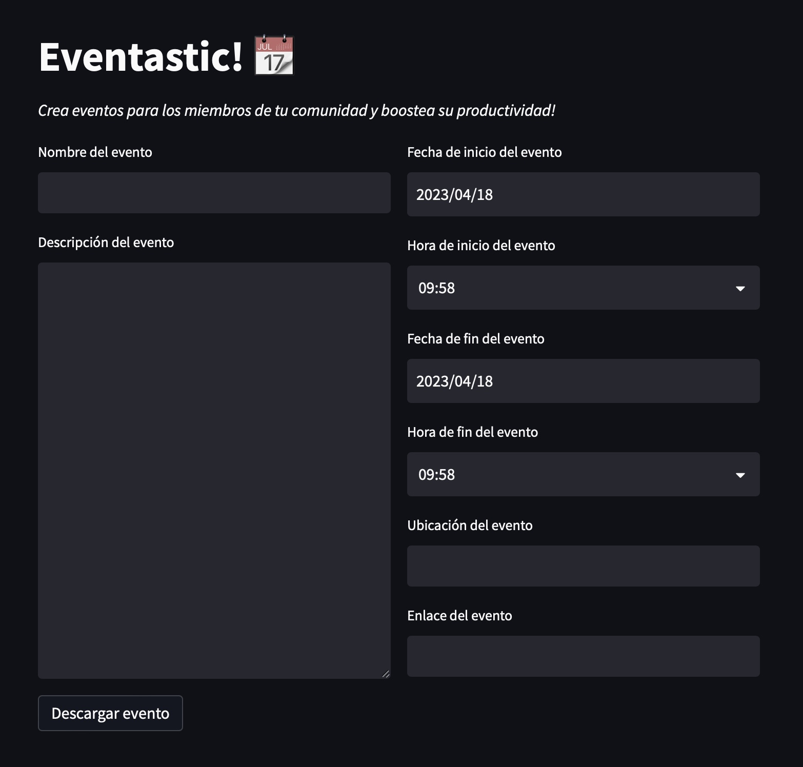

# Create a calendar event for communities

Everyone can manage their own calendar, right? But what if you could help them with this task?
This app aims to make it easy to manage different events for communities, so that each member of the community doesn't need to manage those events themselves, they just need to be there when it starts and organize their life in order to attend.
 
# Helping event managers

You can definitely help your communities using Eventastic by creating events for your members, but you are also helping your own managers by doing so.
It is likely that you host more than one community, each with different events. Your managers also need to create their own events and, of course, join the ones that the business creates (using Teams, for example).
At the end of the day, their calendar is filled with noise, and they can't focus on what matters.
Using Eventastic provides them with an easy tool to manage events for their communities and keep their own events separate.

# Try it yourself

[Here](https://event-astic.streamlit.app) you can taste de webapp yourself, and use it for free wherever you need it.